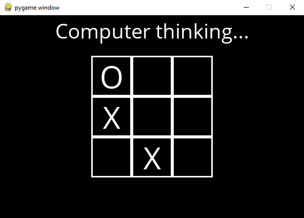

# Noughts and Crosses AI

A bot that play Noughts and Crosses (tic-tac-toe). 

The AI uses the minimax algorithm to search for the optimal move. Alpha-beta pruning is used for efficiency.

The game is implemented in pygame, modified from code provided by "CS50's Introduction to Artificial Intelligence with Python" course.
